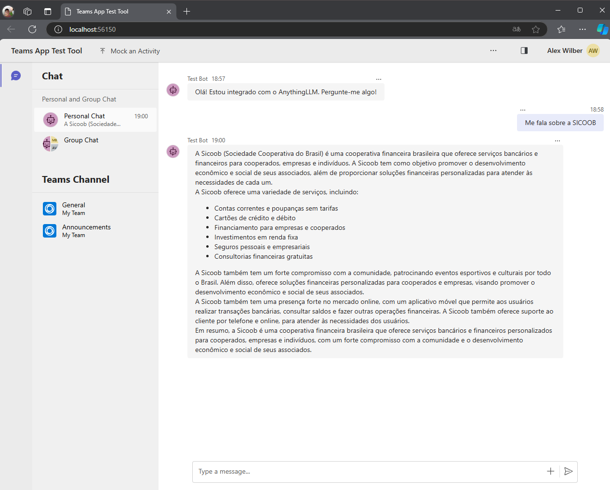

# Teams Bot Integrado com AnythingLLM

Este é um projeto de bot para o Microsoft Teams, criado com o Teams Toolkit e modificado para integrar-se ao [AnythingLLM](https://github.com/AnythingLLM). O bot permite a comunicação direta entre usuários do Teams e a API do AnythingLLM, fornecendo respostas automatizadas em threads de chat.

## Índice
- [Visão Geral](#visão-geral)
- [Requisitos](#requisitos)
- [Instalação e Configuração](#instalação-e-configuração)
- [Uso](#uso)
- [Estrutura do Projeto](#estrutura-do-projeto)
- [Implementação das Modificações](#implementação-das-modificações)


## Visão Geral

Este bot foi desenvolvido usando o Teams Toolkit e utiliza TypeScript para sua implementação. As principais funcionalidades incluem:
- Receber e responder a mensagens de usuários no Microsoft Teams.
- Comunicar-se com a API do AnythingLLM para fornecer respostas automáticas.
- Gerenciar threads de chat para manter o contexto das conversas.

## Requisitos

- Node.js (versão 14 ou superior)
- NPM (ou Yarn)
- Microsoft Teams Toolkit
- Conta e API do AnythingLLM

## Instalação e Configuração

1. **Clone o repositório:**
   ```bash
   git clone https://github.com/victorsouzadev/teste-bot-teams.git
   cd teste-bot-teams
   ```

2. **Instale as dependências:**
   ```bash
   npm install
   ```

3. **Configuração das Variáveis de Ambiente:**
   Crie um arquivo `.env` na pasta `env` e adicione as seguintes variáveis:
   ```env
   ANYTHING_LLM_API_URL=<SUA_URL_DA_API>
   ANYTHING_LLM_API_KEY=<SUA_CHAVE_DE_API>
   ```

4. **Execute o bot localmente:**
   ```bash
   npm run dev:teamsfx:testtool
   ```
   Isso iniciará o servidor local e conectará o bot ao Microsoft Teams através do Teams Toolkit.

## Uso

- Envie uma mensagem direta ao bot no Microsoft Teams.
- O bot irá processar a mensagem, enviar para o AnythingLLM e retornar a resposta processada.
- Em caso de falha na comunicação com a API, o bot notificará o usuário com uma mensagem de erro genérica.



## Estrutura do Projeto

A estrutura do projeto é organizada da seguinte forma:

```
├── .vscode                     # Configurações do Visual Studio Code
│   ├── extensions.json
│   ├── launch.json
│   ├── settings.json
│   └── tasks.json
├── appPackage                  # Pacote de aplicação do Teams
│   ├── color.png
│   ├── manifest.json
│   └── outline.png
├── devTools                    # Ferramentas de desenvolvimento
│   └── teamsapptester
│       ├── node_modules
│       ├── package.json
│       └── .testToolInstallInfo.json
├── env                         # Arquivos de configuração do ambiente
│   ├── .env.dev
│   ├── .env.dev.user
│   ├── .env.local
│   ├── .env.local.user
│   └── .env.testtool
├── infra                       # Arquivos de infraestrutura
│   ├── azurebot.bicep
│   ├── azure.parameters.json
│   └── botRegistration
├── node_modules                # Dependências do Node.js
├── .gitignore                  # Arquivos e pastas ignorados pelo Git
├── config.ts                   # Configurações gerais do bot
├── index.ts                    # Arquivo principal de inicialização
├── package.json                # Dependências e scripts do projeto
├── README.md                   # Este arquivo
├── tsconfig.json               # Configurações do TypeScript
└── web.config                  # Configurações de hospedagem no Azure
```

## Implementação das Modificações

As principais modificações feitas no bot padrão do Teams Toolkit incluem:

- **Integração com o AnythingLLM:**
  - O bot agora se comunica com o AnythingLLM por meio de uma série de endpoints, incluindo verificação de autenticação, criação de novas threads de chat e envio de mensagens.
  
- **Função Utilitária para Requisições:**
  - Foi adicionada uma função genérica `httpRequest` para realizar requisições HTTP de forma centralizada, evitando duplicação de código e melhorando o tratamento de erros.

- **Tratamento de Mensagens do Usuário:**
  - A lógica de formatação da mensagem do usuário foi separada em uma função específica para melhorar a organização do código.
